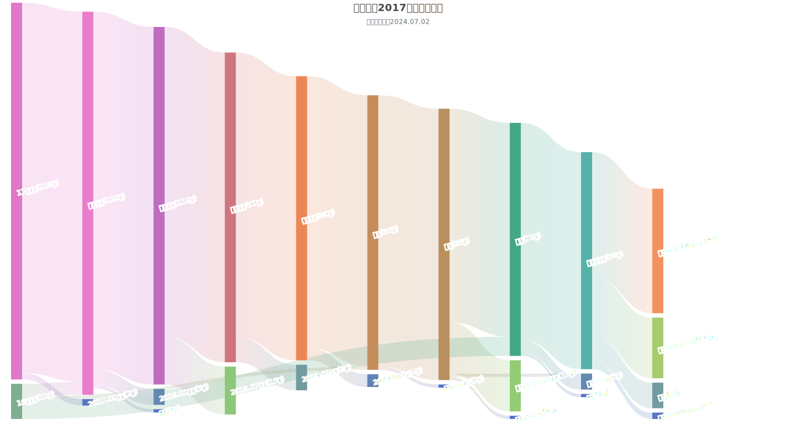

# 中欧学院2017级人数变化图

> **中欧学院**：中国民航大学 中欧航空工程师学院

本项目整理了**2017年9月至2024年6月期间**中欧学院**2017级的人数变动数据**，绘制了一幅**桑基图**📉

若您发现数据有错误，可在 [issue](https://github.com/cauc-siae/sankey-diagram-of-grade-17/issues) 中提出。

---

- 可交互网页：https://cauc-siae.github.io/sankey-diagram-of-grade-17

- 矢量图：

